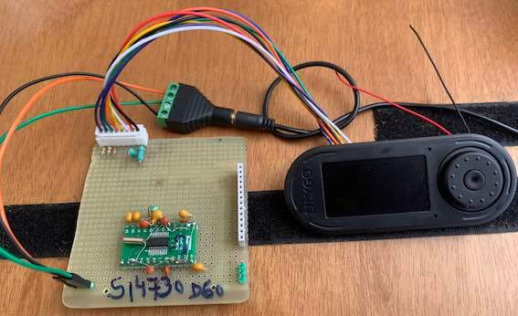
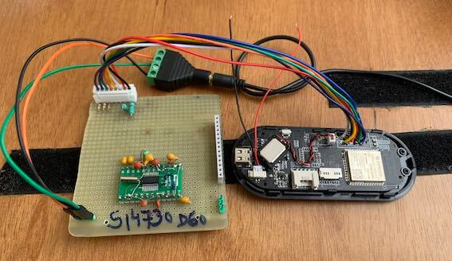

# LilyGO/T-Embed setup

LilyGO/T-Embed  is a panel that uses the ESP32S, an rotary encoder with push button, and a TFT ST7789 display, all together,  for application development. The picture below shows LilyGO/T-Embed.


## Preface

This document is about the LilyGo T-Embed device as a receiver based on the SI473X IC family. The main parts of the sketch used here was written by [Volos](https://github.com/VolosR/TEmbedFMRadio). The Volos' project is a receiver based on the TEA5767 device and I have just adapted and documented the needed steps to port the Volos' project to work with a receiver based on the SI473X device. 

All you have to know to use this project with your LilyGo T-Embed panel can be found here. 


<BR> 


As you can see in the picture above, the LilyGO/T-Embed has some extra pins that you can use in your application. See Grove, GPIO PINOUT, and TFT Card Slot.  Preferably, use the pins SDA (IO18), SCL (IO8), IO16, IO17, IO40, IO38 and IO41.  The picture below shows the ESP32 pinout.    


<BR>


[See this link for more details about LilyGo T-Embed](https://github.com/Xinyuan-LilyGO/T-Embed)


## Arduino setup

* On Arduino IDE, go to Preferences, edit the field "Additional Boards Manager URLs:" and add the URL 
https://raw.githubusercontent.com/espressif/arduino-esp32/gh-pages/package_esp32_index.json . 

* After, on Tools menu, select the option "Board:", "Boards Manager...". 
Look for esp32 and install it.


* [Go to LilyGo T-Embed github repository](https://github.com/Xinyuan-LilyGO/T-Embed) and download it. 
Unzip the downloaded file, go to __lib__ folder, copy and paste __RotaryEncoder__ and __TFT_eSPI__ folders to the your Arduino installation, libraries folder (in general Documents/Arduino/libraries/). See picture below.

<BR>


<BR>

* __Install the Arduino library FastLED using Arduino IDE, tools menu, Manager libraries... option.__ See picture below.


## LilyGo T-Embed and SI473X connection

The table and pictures below show the LilyGo T-Embed and SI473X devices connection. 


### LilyGo T-Embed device wire up

  | Device name      | Device Pin / Description  |  ESP32        |
  | ---------------- | --------------------------| ------------  |
  |    LilyGo        | GPIO16 used for resetting |               |
  |                  | SDA/SDIO                  |  GPI18        |
  |                  | SCL/SCLK                  |  GPI8         |
  

### ESP32 and SI4735-D60 or SI4732-A10 wire up


  | Si4735  | SI4732   | DESC.  | ESP32    (GPIO)    |
  |---------| -------- |--------|--------------------|
  | pin 15  |  pin 9   | RESET  | 16 (GPIO16)        |
  | pin 18  |  pin 12  | SDIO   | 18 (SDA / GPIO18)  |
  | pin 17  |  pin 11  | SCLK   |  8 (SCL / GPIO8)   |


<BR>





<BR>



<BR>


### ISSUES


In some cases you can get errors below during FastLED library compilation. 


<B>
/Users/XXXXX/Documents/Arduino/libraries/FastLED/src/platforms/esp/32/clockless_rmt_esp32.cpp: In static member function 'static void ESP32RMTController::init(gpio_num_t)':
<BR>
/Users/XXXXX/Documents/Arduino/libraries/FastLED/src/platforms/esp/32/clockless_rmt_esp32.cpp:111:15: error: variable 'espErr' set but not used [-Werror=unused-but-set-variable]
<BR>
esp_err_t espErr = ESP_OK;
<BR>
/Users/XXXXX/Documents/Arduino/libraries/FastLED/src/platforms/esp/32/clockless_rmt_esp32.cpp: In member function 'void ESP32RMTController::startOnChannel(int)':
<BR>
/Users/XXXXX/Documents/Arduino/libraries/FastLED/src/platforms/esp/32/clockless_rmt_esp32.cpp:239:15: error: variable 'espErr' set but not used [-Werror=unused-but-set-variable]
<BR>
esp_err_t espErr = ESP_OK;
<BR>
<BR>
cc1plus: some warnings being treated as errors

</B>

<BR>

To solve that problem edit the file Documents/Arduino/libraries/FastLED/src/platforms/esp/32/clockless_rmt_esp32.h (See the right path of your Arduino installation) and choose one of the following two methods:


#### Methode one

```c++
#ifndef FASTLED_RMT_SERIAL_DEBUG
#define FASTLED_RMT_SERIAL_DEBUG 0
#endif
```

Replace from FASTLED_RMT_SERIAL_DEBUG 0 to  FASTLED_RMT_SERIAL_DEBUG 1 as shown below

```c++
#ifndef FASTLED_RMT_SERIAL_DEBUG
#define FASTLED_RMT_SERIAL_DEBUG 1
#endif
```

#### Methode two

Replace 
<BR>

```c++
#if FASTLED_RMT_SERIAL_DEBUG == 1
#define FASTLED_DEBUG(format, errcode, ...) if (errcode != ESP_OK) { Serial.printf(PSTR("FASTLED: " format "\n"), errcode, ##__VA_ARGS__); }
#else
#define FASTLED_DEBUG(format, ...)
#endif
```

<BR>
to
<BR>

```c++
#if FASTLED_RMT_SERIAL_DEBUG == 1
#define FASTLED_DEBUG(format, errcode, ...) if (errcode != ESP_OK) { Serial.printf(PSTR("FASTLED: " format "\n"), errcode, ##__VA_ARGS__); }
#else
#define FASTLED_DEBUG(format, errcode, ...) if (errcode != ESP_OK) {  }
#endif
```


## References 

* [Go to LilyGo T-Embed github repository](https://github.com/Xinyuan-LilyGO/T-Embed)
* [LILYGO Unveils the T-Embed ESP32-S3-Powered Universal Remote for Smart Home Projects and More](https://www.hackster.io/news/lilygo-unveils-the-t-embed-esp32-s3-powered-universal-remote-for-smart-home-projects-and-more-cad2e701d640)
* [Vols's receiver based on TEA5767 Youtube Video](https://youtu.be/bg2Ysrh85Ek)
* [VolosR's Repository](https://github.com/VolosR/TEmbedFMRadio)


